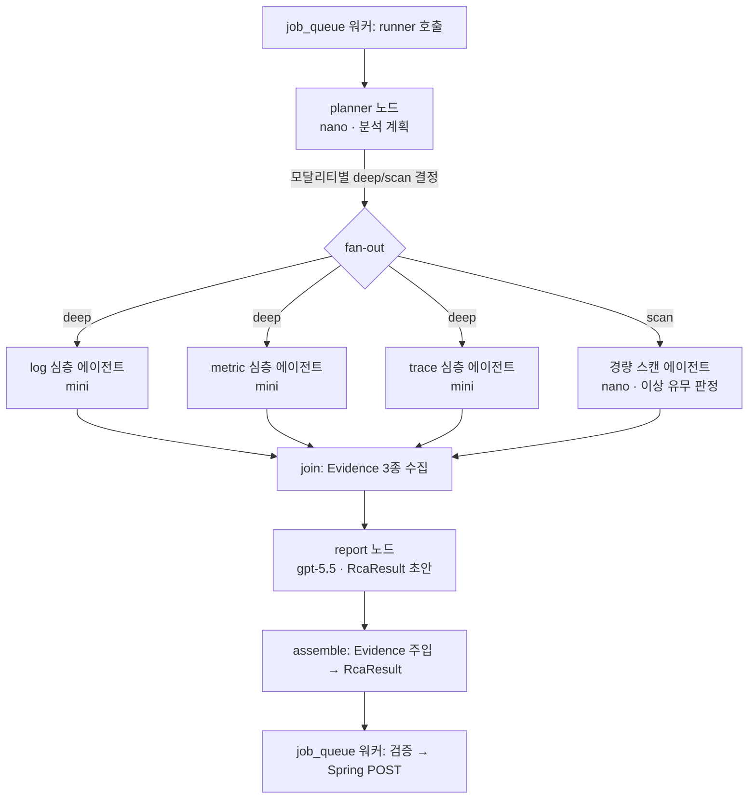

# LLM 에이전트 설계 (RCA 심층 분석)

얕은(rule-based) 에이전트를 LLM 심층 분석으로 승격하기 위한 설계 문서.
LangChain + LangGraph 기반이며, 기존 주입 계약([orchestrator.py](../app/agents/orchestrator.py)의 시그니처)을 그대로 지켜 갈아끼운다.

## 모델 선정

| 역할 | 모델 (스냅샷 고정) | 근거 |
|---|---|---|
| planner (분석 계획) | `gpt-5.4-nano-2026-03-17` | 메타데이터만 보고 deep/scan을 고르는 분류 작업 — nano의 설계 용도 |
| 경량 스캔 (비의심 모달리티) | `gpt-5.4-nano-2026-03-17` | "이상 징후 유무" 판단이 담긴 결론 생성. mini의 ¼ 비용 |
| 모달리티 심층 분석 3종 | `gpt-5.4-mini-2026-03-17` | 대용량 raw 입력의 증거 추출·요약. 호출량이 많아 미니 티어로 비용 억제 |
| RCA 리포트 (종합) | `gpt-5.5-2026-04-23` | 상관분석·rootCause 추론은 품질이 곧 제품. 입력이 정제된 Evidence뿐이라 토큰 부담 적음 |

- 당초 gpt-5 / gpt-5-mini(2025-08-07 스냅샷)를 쓰려 했으나 **2026-12-10 API 종료 예정(deprecated)** 이라 현행 후속 티어로 확정.
- 모델 ID는 코드에 하드코딩하지 않고 `.env`로 주입한다 (아래 [설정](#설정의존성) 참조). 스냅샷 교체 = env 한 줄.

## 아키텍처 (LangGraph)



- 그래프 상태(State): `bundle`, `plan`, `log_ev`, `metric_ev`, `trace_ev`, `result`를 담는 TypedDict.
- 모달리티 노드들은 deep/scan 어느 쪽이든 병렬 실행. **모든 모달리티가 LLM을 거친다** — deep은 전체 심층 분석, scan은 "이상 징후 유무" 판정 수준의 경량 확인.
- 기존 rule-based 에이전트(`*_agent.py`)는 **사용하지 않는다(제거 대상)**. 실패 처리는 아래 [실패 처리](#실패-처리) 참조.
- 그래프 전체를 `Orchestrator`의 대체 구현으로 감싸고, `RcaRunner` 시그니처(`(job_id, bundle) → RcaResult`)를 유지해 [job_queue](../app/services/job_queue.py)는 무변경.

## 노드 상세

### 1. planner (라우터)

- **입력**: raw 데이터 없이 메타데이터만 — `trigger_info`(trigger_time, triggered_by), `modality_info` 구간 요약, 모달리티별 건수. 수백 토큰 수준.
- **출력** (structured output): 모달리티별 `deep | scan` 결정 + 사유.
  ```json
  {"log": "deep", "metric": "scan", "trace": "deep", "reason": "..."}
  ```
- **`triggered_by`의 위상**: SDK의 rule-based 1차 감지 신호일 뿐이므로 **승격 근거로만 쓰고, 강등 근거로 쓰지 않는다.** "triggered_by에 있으면 deep"은 하한선이고, 역방향("없으니 scan")은 성립하지 않는다 — 트리거에 안 걸린 모달리티의 deep/scan은 planner가 메타데이터(건수, 구간 status·침묵 구간 등)로 별도 판단한다.
- **판단 편향**: 애매하면 `deep` (프롬프트에 명시). 오판 비용이 비대칭 — 불필요한 deep은 mini 호출 1회 낭비지만, 잘못된 scan 강등은 정확도 손실.
- **가드레일(코드 강제, LLM 판단보다 우선)**:
  - `triggered_by`에 포함된 모달리티는 무조건 `deep`.
  - 데이터가 0건인 모달리티는 LLM 없이 코드가 "데이터 없음" Evidence를 생성 (호출 생략).
  - planner 호출 실패 시 전 모달리티 `deep` (안전 기본값).

### 2. 경량 스캔 에이전트 (scan)

- **역할**: planner가 비의심으로 분류한 모달리티에 대해 "이상 징후 유무"를 빠르게 판정한다. 리포트 에이전트가 "확인했고 정상"과 "확인 안 함"을 구분할 수 있어야 하므로, 개수 세기가 아닌 실제 판단이 필요하다.
- **입력**: 심층 에이전트와 동일한 `parse_for_*_agent()` 산출물.
- **출력**: 해당 모달리티의 Evidence (심층과 동일 스키마). `conclusion`에 이상 유무 판정을 담고, 특이 항목이 있으면 소수만 첨부.
- **승격 루프는 두지 않는다** — scan이 이상을 발견해도 deep을 다시 호출하지 않고, 발견 내용을 Evidence에 담아 report가 판단하게 한다 (그래프 단순화, 토큰 상한 예측 가능).

### 3. 모달리티 심층 에이전트 (log / metric / trace)

- **입력**: [bundle_parser](../app/services/bundle_parser.py)의 `parse_for_*_agent()` 산출물을 그대로 프롬프트에 바인딩. 정답 유출 방지 규칙(title·bundle_id·fileName 제외, D-020/D-021)은 파서가 이미 보장한다.
- **출력** (structured output): 각각 `LogEvidence` / `MetricEvidence` / `TraceEvidence` ([contracts.py](../app/schemas/contracts.py)).
  - trace 에이전트는 `origin_service`를 채운다 → report가 대표 `service`로 승격 (Q-007).
- **실패 폴백**: deep/scan 호출이 예외를 던지면 해당 모달리티는 "분석 실패" Evidence로 대체하고 그래프는 계속 진행한다 (아래 [실패 처리](#실패-처리) 참조).

### 4. report (RCA 리포트 에이전트)

- **입력**: Evidence 3종 + 최소 컨텍스트(window, trigger_time, triggered_by). raw 데이터는 다시 넣지 않는다.
- **출력** (structured output): `RcaResult`에서 `detail.evidence`를 제외한 초안 스키마(`ReportDraft`) — `type`, `severity`, `service`, `rca`, `summary`, `impact`, `actions`.
  - `evidence`는 LLM이 재복사하지 않고 **assemble 단계(코드)에서 모달리티 산출물을 그대로 주입**한다. 토큰 절약 + 원본 보존.
  - `service`는 trace의 `origin_service` 우선, 없으면 LLM 판정.
- 최종 `RcaResult`는 워커의 기존 게이트(`validate_rca_result`)를 그대로 통과해야 Spring으로 전송된다 — 검증 이중화(structured output 스키마 + 5키 계약 검증).

## 토큰 절약 전략

1. planner가 raw를 안 본다 — 메타데이터만으로 분기 (nano).
2. 비의심 모달리티는 nano 스캔으로 강등 — mini 대비 ¼ 비용. 데이터 0건이면 호출 자체를 생략.
3. report는 정제된 Evidence만 입력 — raw 재투입 금지.
4. evidence는 LLM 출력이 아니라 코드 주입 — 출력 토큰 절감.
5. reasoning effort 차등: planner·scan `low`, 심층 `medium`, report `high`.

## 동시성·레이트리밋 (OpenAI Tier 1 기준)

Tier 1 대략치: gpt-5 계열 **~500K TPM, 500~1,000 RPM** (모델별 정확값은 배포 전 platform.openai.com → Settings → Limits에서 재확인).

**병목 분석** — RPM이 아니라 **TPM**이다. 잡당 LLM 호출은 최대 5회(planner + 모달리티 3 + report)로 호출 수는 미미하지만, 심층 분석 입력은 번들 raw 전체라 잡당 수만~수십만 토큰까지 커질 수 있다. 워커 2개 × 병렬 3 심층이 겹치면 분당 토큰이 TPM 한도에 닿아 429가 난다.

**제어 3계층**:

1. **잡 동시성 (기존)** — `rca_worker_concurrency`(기본 2)가 이미 동시 잡 수를 묶는다. LLM 도입 후에도 이 값이 1차 밸브.
2. **LLM 호출 세마포어 (신규)** — 모든 LLM 호출을 전역 `asyncio.Semaphore`로 감싼다. 상한은 `OPENAI_MAX_CONCURRENCY`(기본 4)로 주입. 워커·그래프 구조와 무관하게 동시 in-flight 호출 수를 보장하는 2차 밸브.
3. **입력 압축·상한 (신규)** — 모달리티별 압축은 [번들 raw 압축 전략](bundle-compression.md) 문서 참조. 압축 후에도 초과하면 트리거 시각 주변을 우선 보존하며 절단한다(절단 사실을 프롬프트에 명시).

## 429 재시도 정책

- LLM 레이어: `langchain-openai`의 `ChatOpenAI(max_retries=...)` 내장 재시도 사용 — 지수 백오프로 `Retry-After` 헤더를 존중한다. `OPENAI_MAX_RETRIES`(기본 3)로 주입.
- 워커 레이어(기존): job_queue의 1회 재시도는 그대로 둔다. 429는 LLM 레이어가 백오프로 흡수하는 것이 원칙이고, 워커 재시도는 그 외 실패(파싱·검증 등)용. LLM 재시도가 소진된 429가 워커 재시도로 이어져도 추가 1회뿐이라 폭주하지 않는다.
- 재시도까지 소진되면 [실패 처리](#실패-처리)의 부분/전체 실패 경로를 탄다.
- 재시도는 호출별 독립(전역 조율 없음)이며, 세마포어 상한(4) 규모에선 엇갈린 재시도의 총량이 무해하다. 워커 수를 크게 늘리는 시점의 확장 지점: **전역 쿨다운 게이트** — 429 관측 시 공유 "재개 시각"을 세팅하고 모든 신규 호출이 발사 전 확인.

## 실패 처리

실패는 두 층으로 나눈다. rule-based stub을 가짜 분석으로 끼워넣지 않고, 실패는 실패로 정직하게 전달한다.

| 층위 | 상황 | 처리 |
|---|---|---|
| 부분 실패 | 일부 모달리티의 LLM 호출 실패 (재시도 후) | 해당 Evidence의 `conclusion`에 "분석 실패"를 명시하고 파이프라인 완주. 기존 5키 계약 그대로 전달 — Spring 계약 변경 불필요 |
| 전체 실패 | report까지 실패, 워커 재시도 소진 | `status=FAILED` + `error`(사유)로 Spring에 전송. `spring_client.save_failure`의 잠정안을 정식 계약으로 승격 — **Spring 측에 FAILED 수신 계약 확정 요청 (api-spec §6 미결)** |

전체 실패 계약에서 Spring과 확정할 항목: `status=FAILED` 수신 허용(D-022 재검토), `error` 필드, `result` 부재 허용, 프론트 실패 표시 방식.

기존 rule-based 에이전트(`log_agent.py` 등 얕은 분석 3종 + `report_agent.py`)는 LLM 구현이 검증되면 제거한다.

## 시스템 프롬프트 관리

**에이전트당 파일 1개**로 분리한다 (단일 파일 방식은 에이전트가 늘수록 diff·리뷰·수정 단위가 엉키므로 배제).

```
app/agents/prompts/
├── _common.md      # 공통 규칙: 출력 언어, 정답 유출 금지, 근거 없는 단정 금지 등
├── planner.md
├── scan.md         # 경량 스캔 공통 (모달리티는 변수로 주입)
├── log.md
├── metric.md
├── trace.md
└── report.md
```

- 각 파일은 순수 마크다운. 변수 자리는 `{window_start}` 형식 플레이스홀더로 두고 LangChain `ChatPromptTemplate`에 바인딩한다.
- 로더(`app/agents/prompts/__init__.py`): `load_prompt(name)` — `_common.md` + 해당 파일을 이어붙여 시스템 프롬프트로 반환. `functools.cache`로 1회만 읽는다.
- 프롬프트 수정 = md 파일 수정. 코드 변경·재배포 없이 리뷰 가능한 단위가 된다.

## 설정·의존성

`.env` / [config.py](../app/core/config.py) 추가:

```
OPENAI_API_KEY=sk-...
OPENAI_MODEL_REPORT=gpt-5.5-2026-04-23
OPENAI_MODEL_ANALYSIS=gpt-5.4-mini-2026-03-17
OPENAI_MODEL_LIGHT=gpt-5.4-nano-2026-03-17   # planner + scan 공용
OPENAI_MAX_CONCURRENCY=4                      # 전역 LLM 동시 호출 상한 (세마포어)
OPENAI_MAX_RETRIES=3                          # 429 등 재시도 횟수 (지수 백오프)
```

의존성 추가: `langgraph`, `langchain-openai`

## 구현 순서

1. 의존성·설정 추가 (`config.py`, `.env.example`)
2. LLM 공통 계층 — 모델 팩토리 + 전역 세마포어 + 재시도 설정, 입력 절단 유틸
3. 프롬프트 폴더 + 로더
4. 모달리티 심층 에이전트 3종 (기존 시그니처 준수, structured output)
5. 경량 스캔 에이전트 (심층과 동일 시그니처, 모달리티 파라미터화)
6. planner + LangGraph 그래프 조립 (부분 실패 시 "분석 실패" Evidence 처리 포함)
7. report 에이전트 + assemble
8. `Orchestrator` 교체 주입 + 통합 테스트 (LLM 모킹, 기존 test_pipeline 계약 유지)
