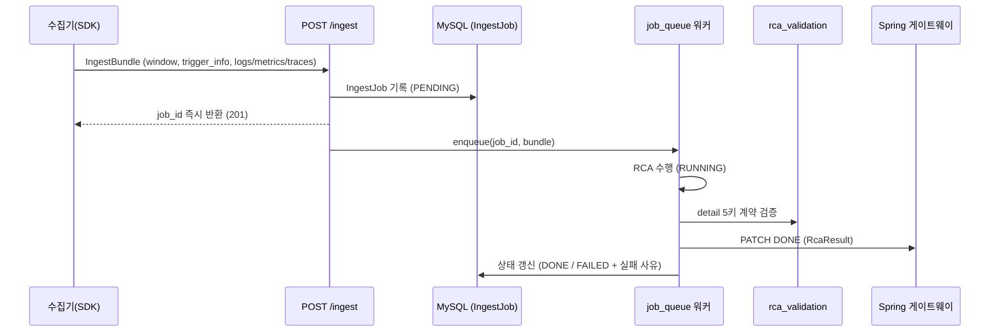

# 처리 흐름 (Flow)

CHOK v2 AI Backend의 RCA 처리 파이프라인 계획 문서.

## 전체 파이프라인

1. **수신** — 수집기가 `POST /ingest`로 `IngestBundle`을 전송하면, `IngestJob(PENDING)`만 DB에 기록하고 `job_id`를 즉시 반환한다. 실제 분석은 큐에 위임한다.
2. **비동기 RCA** — `job_queue`의 asyncio 워커 풀이 잡을 꺼내 RCA를 수행한다. 현재 runner는 stub이며, 추후 `app/agents/`의 오케스트레이터로 교체 예정.
3. **계약 검증** — 산출물은 `rca_validation`이 detail 5키(`rca`, `summary`, `evidence`, `impact`, `actions`) 계약을 검증한다. 5키는 프론트 상세 탭과 1:1 고정. 위반 시 잡은 FAILED 처리.
4. **결과 전달** — 최종 `RcaResult`(type / severity / service + detail)를 `spring_client`가 Spring 게이트웨이로 PATCH DONE 전송한다.

## 잡 수명주기

- 상태 머신: `PENDING → RUNNING → DONE / FAILED` (실패 시 사유를 `error` 컬럼에 기록)
- 상태 조회: `GET /ingest/{job_id}`
- 정리: `job_cleanup`이 종료(DONE/FAILED)된 잡을 보존기간(기본 24h) 경과 후 주기(기본 1h)마다 삭제. 진행 중인 잡은 보호.

## 기동·종료

`app/main.py`의 lifespan에서 `job_queue`와 `job_cleaner`를 asyncio 태스크로 기동하고, 종료 시 graceful stop 한다.

## 향후 계획

`app/agents/`에 모달리티 에이전트 3종(log / metric / trace) + 종합 에이전트가 들어갈 예정 (**아직 미구현**). trace 에이전트가 채우는 `origin_service`를 종합 에이전트가 대표 `service`로 승격하는 흐름(Q-007)이 계약 초안에 포함되어 있다.
